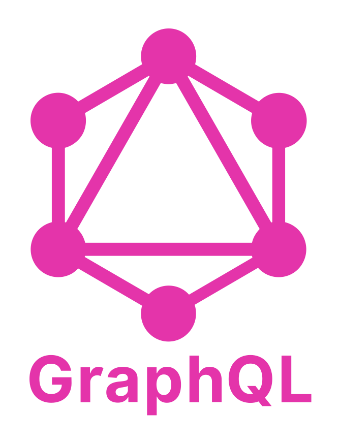

## GraphQL Foundation Artwork and Logos

Note: GitHub Flavored Markdown used in the Readme doesn't support background colors. The white logos below are displayed on the light grey of tables.

### Color Palette

<table style="text-align:center">
	<tr>
		<th colspan=3>
	</tr>
		<th></th>
		<th width="150">RGB</th>
		<th width="150">CMYK</th>
		<th width="150">Pantone</th>
		<th width="150">Hex</th>
	</tr>
		<td></td>
		<td>(228, 52, 170)</td>
		<td>(0, 77, 25, 11)</td>
		<td>Rhodamine Red C</td>
		<td>#E434AA</td>
	</tr>
</table>

### Logos

#### GraphQL

<table>
    <tr>
    	<th colspan="7"></th>
    </tr>
    <tr>
        <th></th>
        <th colspan="3">PNG</th>
        <th colspan="3">SVG</th>
    </tr>
    <tr>
        <th></th>
        <th>horizontal</th>
        <th>stacked</th>
        <th>icon</th>
        <th>horizontal</th>
        <th>stacked</th>
        <th>icon</th>
    </tr>
    <tr>
        <th>color</th>
        <td></td>
        <td></td>
        <td></td>
        <td></td>
        <td></td>
        <td></td>
    </tr>
    <tr>
        <th>black</th>
        <td></td>
        <td></td>
        <td></td>
        <td></td>
        <td></td>
        <td></td>
    </tr>
    <tr>
        <th>white</th>
        <td></td>
        <td></td>
        <td></td>
        <td></td>
        <td></td>
        <td></td>
    </tr>
</table>

#### GraphQL Foundation

<table>
    <tr>
    	<th colspan="7"></th>
    </tr>
    <tr>
        <th></th>
        <th colspan="3">PNG</th>
        <th colspan="3">SVG</th>
    </tr>
    <tr>
        <th></th>
        <th>horizontal</th>
        <th>stacked</th>
        <th>icon</th>
        <th>horizontal</th>
        <th>stacked</th>
        <th>icon</th>
    </tr>
    <tr>
        <th>color</th>
        <td></td>
        <td></td>
        <td></td>
        <td></td>
        <td></td>
        <td></td>
    </tr>
    <tr>
        <th>black</th>
        <td></td>
        <td></td>
        <td></td>
        <td></td>
        <td></td>
        <td></td>
    </tr>
    <tr>
        <th>white</th>
        <td></td>
        <td></td>
        <td></td>
        <td></td>
        <td></td>
        <td></td>
    </tr>
</table>

Use of any trademark or logo is subject to the trademark policy available at https://www.linuxfoundation.org/trademark-usage

Questions? Please email [info@graphql.org](mailto:info@graphql.org).
